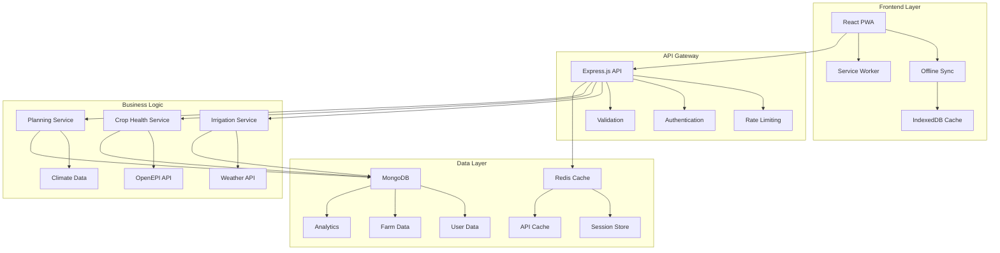

# 🌾 AgriSphere - AI-Powered Digital Agronomist

> **Empowering smallholder farmers with AI-driven agricultural insights, crop diagnosis, smart irrigation, and climate-adaptive planning.**

[](https://nodejs.org/)
[](https://reactjs.org/)
[](./LICENSE)
[](https://github.com/agrisphere/agrisphere)
[](./coverage)

## 📋 Table of Contents

- [✨ Features](#-features)
- [🏗️ Architecture](#️-architecture)
- [🚀 Quick Start](#-quick-start)
- [📖 Documentation](#-documentation)
- [🔧 Development](#-development)
- [🚀 Deployment](#-deployment)
- [🧪 Testing](#-testing)
- [🔒 Security](#-security)
- [📊 Monitoring](#-monitoring)
- [🤝 Contributing](#-contributing)
- [📄 License](#-license)

## ✨ Features

### 🩺 AI Crop Doctor
- **Intelligent Diagnosis**: AI-powered plant disease detection and health assessment
- **Image Recognition**: Upload crop photos for instant analysis using OpenEPI Crop Health API
- **Treatment Recommendations**: Personalized treatment plans and prevention strategies
- **History Tracking**: Complete diagnosis history with progress monitoring

### 💧 Smart Irrigation Advisor
- **Water Optimization**: Advanced evapotranspiration calculations for precise water management
- **Weather Integration**: Real-time weather data for informed irrigation decisions
- **Soil Analysis**: Moisture monitoring and soil health assessments
- **Automated Scheduling**: Smart irrigation timing based on crop needs and weather forecasts

### 📅 Climate-Smart Planner
- **Seasonal Planning**: Data-driven crop selection based on climate patterns
- **Risk Assessment**: Flood risk analysis and climate change adaptation strategies
- **Market Intelligence**: Price trends and demand forecasting
- **Yield Optimization**: Maximize productivity through scientific planning

### 🌍 Comprehensive Farm Management
- **Digital Farm Mapping**: GeoJSON-based farm boundary plotting
- **Multi-language Support**: Available in English, Hindi, Spanish, French, and German
- **Offline Capability**: PWA with offline sync for rural connectivity
- **Analytics Dashboard**: Comprehensive insights and performance metrics

## 🏗️ Architecture

### System Overview



### Technology Stack

#### Backend
- **Runtime**: Node.js 18+ with Express.js framework
- **Database**: MongoDB with Mongoose ODM
- **Caching**: Redis for session management and API caching
- **Authentication**: JWT-based with bcrypt password hashing
- **File Storage**: Multer with Sharp for image processing
- **External APIs**: OpenEPI for weather, soil, and crop health data
- **Validation**: Express-validator with custom security rules
- **Monitoring**: Winston logging with analytics tracking

#### Frontend
- **Framework**: React 19 with modern hooks and concurrent features
- **Build Tool**: Vite for fast development and optimized builds
- **Styling**: Tailwind CSS with custom design system
- **Animations**: Framer Motion for smooth, engaging interactions
- **Maps**: React Leaflet for farm boundary visualization
- **State Management**: Context API with optimized providers
- **PWA**: Service Worker with offline sync capabilities
- **Testing**: Vitest with React Testing Library

#### DevOps & Infrastructure
- **Containerization**: Docker with multi-stage builds
- **Orchestration**: Docker Compose for development
- **CI/CD**: GitHub Actions for automated testing and deployment
- **Monitoring**: Health checks and performance metrics
- **Security**: Rate limiting, input validation, and HTTPS enforcement

## 🚀 Quick Start

### Prerequisites

- Node.js 18+ and npm
- MongoDB 5.0+
- Redis 6.0+ (optional, for caching)
- Docker & Docker Compose (optional)

### Installation

1. **Clone the repository**
   ```bash
   git clone https://github.com/agrisphere/agrisphere.git
   cd agrisphere
   ```

2. **Install dependencies**
   ```bash
   # Install backend dependencies
   cd backend
   npm install
   
   # Install frontend dependencies
   cd ../frontend
   npm install
   ```

3. **Environment Setup**
   ```bash
   # Backend environment
   cd backend
   cp env.example .env
   # Edit .env with your configuration
   
   # Frontend environment
   cd ../frontend
   cp .env.example .env.local
   # Edit .env.local with your configuration
   ```

4. **Database Setup**
   ```bash
   # Start MongoDB (if not running)
   mongod
   
   # Run database migrations
   cd backend
   npm run migrate
   ```

5. **Start Development Servers**
   ```bash
   # Terminal 1: Backend
   cd backend
   npm run dev
   
   # Terminal 2: Frontend
   cd frontend
   npm run dev
   ```

6. **Access the Application**
   - Frontend: http://localhost:3000
   - Backend API: http://localhost:5000
   - API Documentation: http://localhost:5000/api/docs

### Docker Quick Start

```bash
# Start all services with Docker Compose
docker-compose up -d

# View logs
docker-compose logs -f

# Stop services
docker-compose down
```

## 📖 Documentation

### API Documentation

Our REST API is fully documented with OpenAPI/Swagger:

- **Interactive Docs**: `/api/docs` (Swagger UI)
- **OpenAPI Spec**: `/api/docs/openapi.json`

#### Key Endpoints

```javascript
// Authentication
POST   /api/auth/register     // User registration
POST   /api/auth/login        // User login
GET    /api/auth/me           // Get user profile

// Farm Management
GET    /api/farm              // List user farms
POST   /api/farm              // Create new farm
PUT    /api/farm/:id          // Update farm details

// Crop Diagnosis
POST   /api/diagnosis/upload  // Upload crop images
POST   /api/diagnosis/analyze // Analyze crop health
GET    /api/diagnosis/history // Get diagnosis history

// Irrigation
POST   /api/irrigation/recommendation // Get irrigation advice
POST   /api/irrigation/log           // Log irrigation activity
GET    /api/irrigation/history       // Get irrigation history

// Planning
GET    /api/planning/recommendations // Get crop recommendations
GET    /api/planning/calendar        // Get seasonal calendar
POST   /api/planning/compare-crops   // Compare crop options
```

### Frontend Component Library

```javascript
// Core Components
import { WeatherWidget } from '@/components/Dashboard/WeatherWidget'
import { CropCard } from '@/components/Planning/CropCard'
import { IrrigationScheduler } from '@/components/Irrigation/Scheduler'

// Common UI Components
import { LoadingScreen } from '@/components/Common/LoadingScreen'
import { ErrorBoundary } from '@/components/Common/ErrorBoundary'
import { OfflineIndicator } from '@/components/Common/OfflineIndicator'
```

## 🔧 Development

### Development Workflow

1. **Feature Development**
   ```bash
   # Create feature branch
   git checkout -b feature/your-feature-name
   
   # Make changes and test
   npm test
   npm run lint
   
   # Commit with conventional commits
   git commit -m "feat: add irrigation scheduling feature"
   ```

2. **Code Quality**
   ```bash
   # Run linting
   npm run lint
   npm run lint:fix
   
   # Run tests
   npm test
   npm run test:coverage
   
   # Type checking (if using TypeScript)
   npm run type-check
   ```

3. **Database Migrations**
   ```bash
   # Create new migration
   npm run migration:create "add_user_preferences"
   
   # Run migrations
   npm run migrate
   
   # Rollback migration
   npm run migrate:rollback
   ```

### Environment Variables

#### Backend (.env)
```bash
# Server Configuration
PORT=5000
NODE_ENV=development
JWT_SECRET=your-super-secret-jwt-key

# Database
MONGODB_URI=mongodb://localhost:27017/agrisphere
REDIS_URL=redis://localhost:6379

# External APIs
OPENEPI_CLIENT_ID=your-openepi-client-id
OPENEPI_CLIENT_SECRET=your-openepi-client-secret
WEATHER_API_KEY=your-weather-api-key

# File Storage
UPLOAD_PATH=./uploads
MAX_FILE_SIZE=52428800

# Email (Optional)
SMTP_HOST=smtp.gmail.com
SMTP_USER=your-email@gmail.com
SMTP_PASS=your-app-password
```

#### Frontend (.env.local)
```bash
# API Configuration
VITE_API_URL=http://localhost:5000/api
VITE_BUILD_VERSION=1.0.0

# Feature Flags
VITE_ENABLE_ANALYTICS=true
VITE_ENABLE_PUSH_NOTIFICATIONS=false

# External Services
VITE_GOOGLE_MAPS_API_KEY=your-google-maps-key
```

## 🚀 Deployment

### Production Deployment with Docker

1. **Build Production Images**
   ```bash
   # Build backend
   docker build -t agrisphere-backend:latest ./backend
   
   # Build frontend
   docker build -t agrisphere-frontend:latest ./frontend
   ```

2. **Deploy with Docker Compose**
   ```bash
   # Production deployment
   docker-compose -f docker-compose.yml -f docker-compose.prod.yml up -d
   ```

### Manual Deployment

1. **Backend Deployment**
   ```bash
   cd backend
   npm ci --only=production
   npm run build
   npm start
   ```

2. **Frontend Deployment**
   ```bash
   cd frontend
   npm ci --only=production
   npm run build
   # Serve dist/ folder with nginx or static file server
   ```

### Environment-Specific Configurations

- **Development**: Full logging, debug mode, CORS enabled
- **Staging**: Production-like settings with verbose logging
- **Production**: Optimized performance, security hardened, minimal logging

### Health Checks

Monitor application health with built-in endpoints:

```bash
# Basic health check
curl http://localhost:5000/api/health

# Detailed system health
curl http://localhost:5000/api/health/detailed

# Kubernetes probes
curl http://localhost:5000/api/health/status/live    # Liveness
curl http://localhost:5000/api/health/status/ready   # Readiness
```

## 🧪 Testing

### Test Structure

```
tests/
├── unit/                 # Unit tests for business logic
├── integration/          # API integration tests  
├── e2e/                 # End-to-end user flows
├── performance/         # Load and performance tests
└── fixtures/            # Test data and mocks
```

### Running Tests

```bash
# Backend tests
cd backend
npm test                 # Run all tests
npm run test:unit        # Unit tests only
npm run test:integration # Integration tests only
npm run test:coverage    # Coverage report

# Frontend tests
cd frontend
npm test                 # Run all tests
npm run test:ui          # Visual test runner
npm run test:coverage    # Coverage report
```

### Test Examples

```javascript
// Backend unit test
describe('IrrigationService', () => {
  test('should calculate water requirements correctly', async () => {
    const requirements = await irrigationService.calculateWaterRequirement({
      cropType: 'wheat',
      area: 2.5,
      soilMoisture: 45,
      weather: { temperature: 25, humidity: 60 }
    })
    
    expect(requirements.waterAmount).toBeGreaterThan(0)
    expect(requirements.method).toBe('drip')
  })
})

// Frontend component test
import { render, screen, fireEvent } from '@testing-library/react'
import { WeatherWidget } from '@/components/Dashboard/WeatherWidget'

test('displays weather information correctly', () => {
  const mockWeather = {
    current: { temperature: 25, description: 'Sunny' },
    forecast: [{ date: '2024-01-01', high: 28, low: 18 }]
  }
  
  render(<WeatherWidget weatherData={mockWeather} />)
  
  expect(screen.getByText('25°C')).toBeInTheDocument()
  expect(screen.getByText('Sunny')).toBeInTheDocument()
})
```

## 🔒 Security

### Security Features

- **Authentication**: JWT tokens with refresh token rotation
- **Authorization**: Role-based access control (RBAC)
- **Input Validation**: Comprehensive validation with sanitization
- **Rate Limiting**: API rate limiting with IP-based blocking
- **File Security**: File type validation and virus scanning
- **HTTPS**: SSL/TLS encryption in production
- **CORS**: Configurable cross-origin resource sharing
- **SQL Injection**: MongoDB injection prevention
- **XSS Protection**: Content Security Policy headers

### Security Best Practices

```javascript
// Input validation example
const { body, validationResult } = require('express-validator')

router.post('/api/farm', [
  body('name').trim().isLength({ min: 1, max: 100 }).escape(),
  body('coordinates').isArray({ min: 2, max: 2 }),
  body('coordinates.*').isFloat({ min: -180, max: 180 })
], (req, res) => {
  const errors = validationResult(req)
  if (!errors.isEmpty()) {
    return res.status(400).json({ errors: errors.array() })
  }
  // Process validated input
})
```

### Vulnerability Scanning

```bash
# Dependency vulnerability scan
npm audit
npm audit fix

# Security linting
npm run security-check

# Container security scan
docker scan agrisphere-backend:latest
```

## 📊 Monitoring

### Application Monitoring

- **Health Checks**: Kubernetes-compatible liveness and readiness probes
- **Metrics Collection**: System and business metrics tracking
- **Error Tracking**: Comprehensive error logging and reporting
- **Performance Monitoring**: API response times and resource usage
- **User Analytics**: Feature usage and user journey tracking

### Monitoring Endpoints

```bash
# System health
GET /api/health/detailed

# Application metrics
GET /api/health/metrics

# Analytics dashboard
GET /api/analytics/dashboard

# Error reports
GET /api/errors/summary
```

### Log Management

```javascript
// Structured logging example
logger.info('User registration successful', {
  userId: user.id,
  email: user.email,
  registrationMethod: 'email',
  timestamp: new Date().toISOString()
})

logger.error('Database connection failed', {
  error: error.message,
  stack: error.stack,
  database: 'mongodb',
  retryAttempt: 3
})
```

## 🤝 Contributing

We welcome contributions from the community! Please read our [Contributing Guide](./CONTRIBUTING.md) for details.

### Development Process

1. **Fork** the repository
2. **Create** a feature branch
3. **Implement** your changes with tests
4. **Submit** a pull request

### Code Standards

- **ES6+** JavaScript with modern syntax
- **Conventional Commits** for commit messages
- **ESLint** for code linting
- **Prettier** for code formatting
- **JSDoc** for function documentation

### Pull Request Guidelines

- Include tests for new features
- Update documentation as needed
- Follow the existing code style
- Provide clear commit messages

## 📊 Performance

### Optimization Features

- **Code Splitting**: Lazy-loaded route components
- **Image Optimization**: WebP conversion and responsive images
- **Caching**: Multi-layer caching strategy
- **Bundle Optimization**: Tree shaking and minification
- **Service Worker**: Offline functionality and background sync

### Performance Metrics

- **First Contentful Paint**: < 1.5s
- **Largest Contentful Paint**: < 2.5s
- **Cumulative Layout Shift**: < 0.1
- **API Response Time**: < 500ms (95th percentile)

## 🌐 Internationalization

### Supported Languages

- 🇺🇸 English (en)
- 🇮🇳 Hindi (hi)
- 🇪🇸 Spanish (es)
- 🇫🇷 French (fr)
- 🇩🇪 German (de)

### Adding New Languages

```javascript
// Add translation files
src/locales/
├── en.json
├── hi.json
├── es.json
└── your-language.json

// Usage in components
import { useTranslation } from '@/contexts/LanguageContext'

const { t } = useTranslation()
return <h1>{t('welcome.title')}</h1>
```

## 📱 Progressive Web App

### PWA Features

- **Offline Support**: Service worker with background sync
- **Push Notifications**: Weather alerts and irrigation reminders
- **Install Prompt**: Add to home screen functionality
- **Responsive Design**: Mobile-first responsive layout
- **Touch Gestures**: Mobile-optimized interactions

### PWA Manifest

```json
{
  "name": "AgriSphere - AI Digital Agronomist",
  "short_name": "AgriSphere",
  "description": "AI-powered agricultural insights for smallholder farmers",
  "start_url": "/",
  "display": "standalone",
  "theme_color": "#10b981",
  "background_color": "#ffffff",
  "icons": [
    {
      "src": "/icons/icon-192x192.png",
      "sizes": "192x192",
      "type": "image/png"
    }
  ]
}
```

## 🔗 Related Projects

- [OpenEPI API](https://api.openepi.io/) - Agricultural data APIs
- [AgriSphere Mobile](https://github.com/agrisphere/mobile) - React Native mobile app
- [AgriSphere Analytics](https://github.com/agrisphere/analytics) - Advanced analytics platform

## 📄 License

This project is licensed under the MIT License - see the [LICENSE](./LICENSE) file for details.

## 🙏 Acknowledgments

- **OpenEPI** for providing agricultural APIs
- **MongoDB** for database support
- **Vercel** for hosting and deployment
- **Contributors** who make this project possible

## 📞 Support

- **Documentation**: [docs.agrisphere.com](https://docs.agrisphere.com)
- **Community Forum**: [community.agrisphere.com](https://community.agrisphere.com)
- **Email Support**: support@agrisphere.com
- **Bug Reports**: [GitHub Issues](https://github.com/agrisphere/agrisphere/issues)

---

<div align="center">
  <strong>🌾 Building the future of agriculture, one farmer at a time 🌾</strong>
  <br><br>
  Made with ❤️ by the AgriSphere Team
</div>